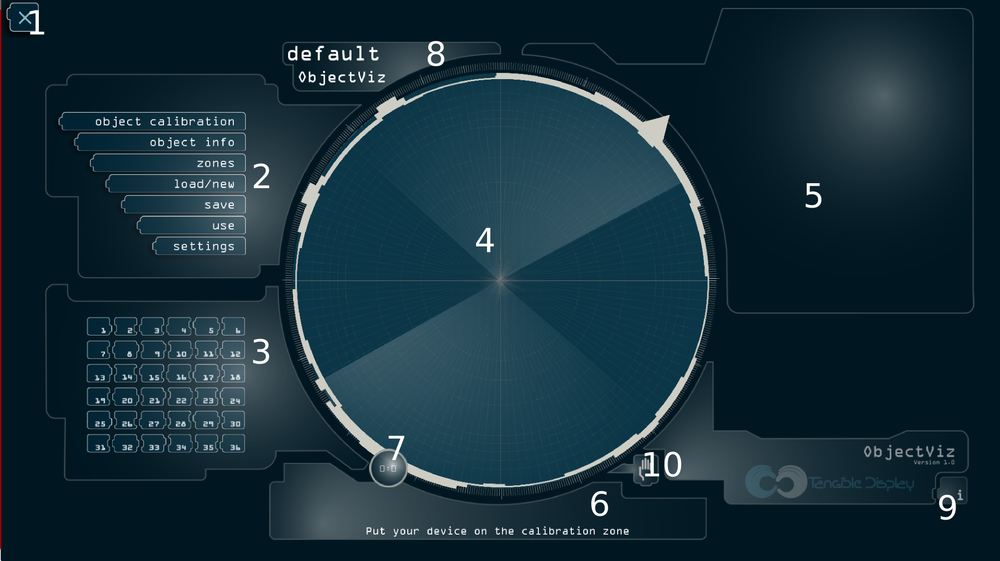

Description of the interface
============================

    Capture of the interface in calibration mode

1. the exit button:

   Allows to exit the application when you are in calibration mode, when you
   are in use or zone mode, allows to go back to calibration mode.

   When in zone or use modes, exiting requires a long press followed by
   pressing each of the buttons that appears out of it. This is important to
   avoid accidental exits in production.

2. menu:

   - object calibration, toggle visibility of the identifier zone (3)
   - object info, toggle visibility of the object statistics
   - zones, allow to enter the `zone` mode
   - load/new, load a different saved set of objects, or create a new empty set
   - save, save the current set of objects to an existing or a new configuration
   - use, enter the `use` mode
   - settings, to open the settings screen (described in the `settings` chapter)

3. object identifiers

   These buttons can be used to assign identifiers to new objects, when pushed,
   they become larger and darker to indicate that they are associated with an
   object. You can reconfigure an identifier by tapping it and selecting
   "forget".

4. detection zone

    The zone that detects objects, when in calibration mode, it only covers
    part of the screen to give access to other parts of the interface, you can
    displace the zone by using the handle (10), double tap the handle (10) to
    replace it automatically to the default position.

5. object statistics zone

    Show statistics about the currently detected objects, namely:

    - the number of collected samples during calibration's second phase
    - the maximum, minimum and mean of measured values for surface and biggest angle of the object

6. status zone

    Indicates if you can currently configure a new object, depending on the
    number of available points.

7. touch status zone

    Indicates the number of touch currently detected, and the number of
    available touches (not attached to any object).

    e.g:

    .. epigraph::

        5:2

    indicates that 5 touches are currently detected, and 3 of them are part of
    an object, the two remaining ones are considered as finger touches.

8. title zone

    Display the current set's name.

9. About and credits

   This button unfold the credit menu to display information about your version
   of the software (to communicate to support), and its copyright information.

10. Detection zone moving handle

    This handle displaces the detection zone when dragged, double tap the handle to
    replace it automatically to the default position.

