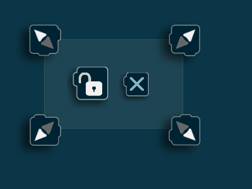

Zone mode
=========

ObjectViz can limit object detection to specific zones, you can use the `zones`
mode (from the menu) to configure them. If no zone is configured, objects will
be recognized in all parts of the screen in `use` mode.

Creating zones
--------------

Any long touch on the detection zone in `zones` mode, will create a new zone,
centered around the touch.

.. figure:: images/zones_create.png
    :scale: 50%

    Waiting time to avoid accidentaly creating zones when touching the screen.

    Our newly created zone

Modifying zones
---------------

You can move a zone by grabbing it from inside, you can resize a zone by
dragging any of its corners.

    A corner allowing to resize the zone

Locking zones
-------------

The `lock` button inside a zone will prevent any change to the zone when
pushed, until it's pushed again.

    The lock button

    A locked zone

Deleting zones
--------------

Zones can be deleted by touching the delete button.

    The delete button
